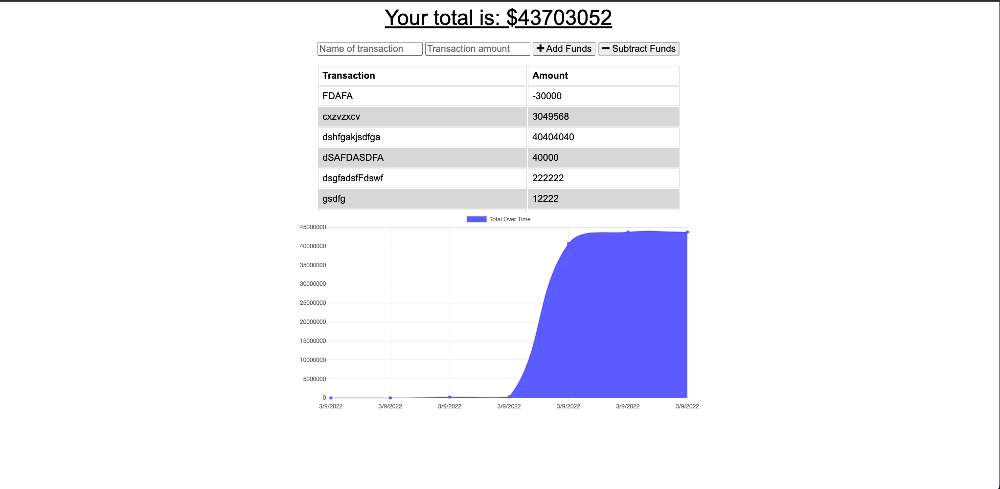

# Budget App

## Description

This app is intended to be a budget tracking program where you can add money spent and also subtract money.

## Table of Contents
* [Installation](#installation)
* [Usage](#usage)
* [Screenshot](#screenshot)
* [Deployed URL](#deployed_url) 
* [Questions](#questions)

## Installation

Visit the url to use the deployed application. Or clone the repo onto your machine and run npm install, then npm start to run off localhost:3001 on your browser.

## Usage

This is a pwa so you can also insstall the app and use it in offline mode wwhere the database will update itself when you come back online.

## Screenshot

## Deployed URL

https://radiant-savannah-17564.herokuapp.com/

## Questions

If you have any questions please reach out to me on GitHub at [https://github.com/Emccar22](https://github.com/Emccar22) or Email me at [e.mccarthy2285@gmail.com](mailto:e.mccarthy2285@gmail.com)